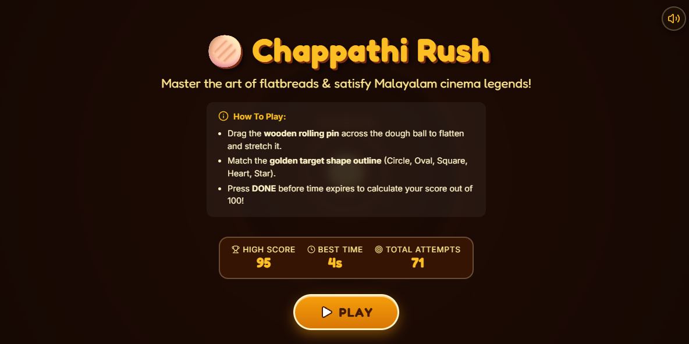
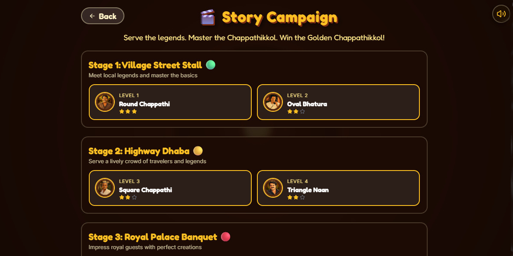
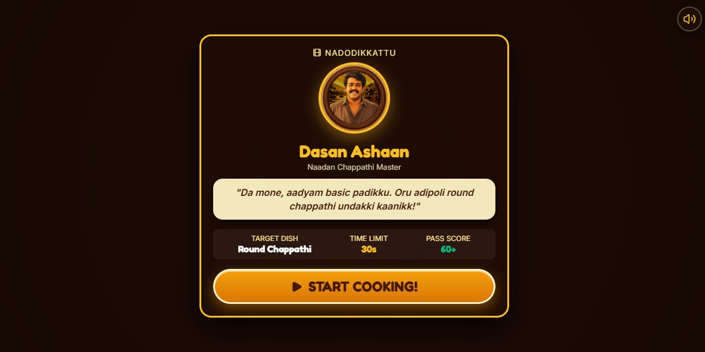
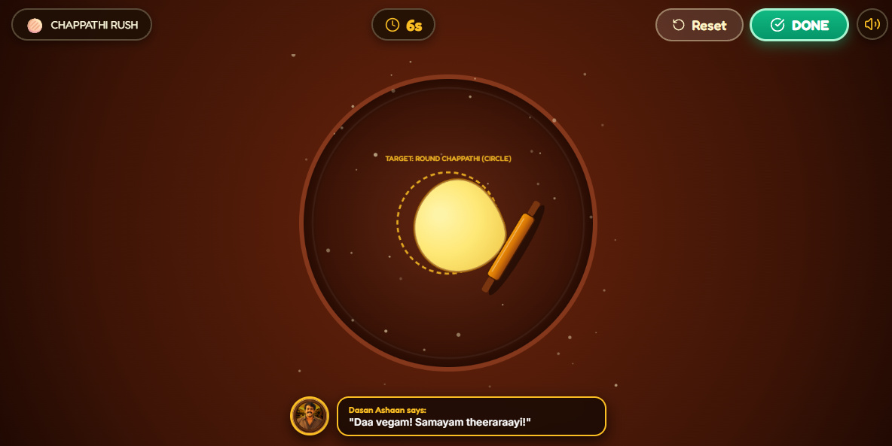
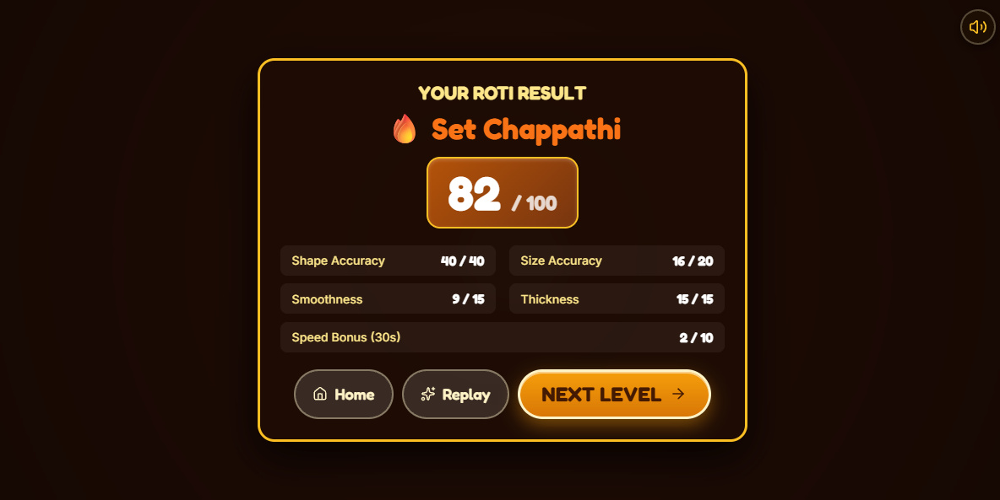

# Chappathi Rush Rush 🫓🎯

## Basic Details

### Team Members
- Team Lead: Adil KM - Farook College, Kozhikode

### Project Description
Chappathi Rush Rush is an interactive, physics-based 2D chappathi rolling game. Players roll, flatten, and squeeze a 64-vertex deformable dough mesh into custom target shapes (circles, ovals, squares, triangles, hearts, stars) to serve to people before time runs out!

### The Problem (that doesn't exist)
Customers are hungry, impatient, and demanding chappathi rolled into absurd geometric shapes (stars, hearts, squares). Making a normal round chappathi is hard enough, but serving a hear shaped chappathi to Nagavalli or a star chappathi to Dr. Sunny in under 30 seconds requires elite rolling pin physics mastery.

### The Solution (that nobody asked for)
A 64-vertex mass-spring deformable dough physics simulation built on HTML5 Canvas, featuring bidirectional deformation (flattening & inward edge squeezing), live funny Malayalam comments, interactive storyline campaign stages, and dynamic score evaluation!

## Technical Details
### Technologies/Components Used
For Software:
- Languages: JavaScript (ES6+), HTML5, CSS3
- Frameworks: React 18, Vite
- Libraries: Howler.js (Audio FX & BGM), Lucide React (UI Icons), Canvas 2D API
- Services: LocalStorage Persistence

### Project Demo
# Screenshots

<table>
  <tr>
     <td colspan="2" align="center"></td>
  </tr>
  <tr>
    <td></td>
    <td></td>
  </tr>
  <tr>
    <td></td>
    <td></td>
    <td></td>
  </tr>
</table>

# Video

<video src="https://github.com/user-attachments/assets/ef700646-315b-4841-ad53-c694e1cc1be2" controls width="100%"></video>

---
Made with ❤️ at TinkerHub Useless Projects 

